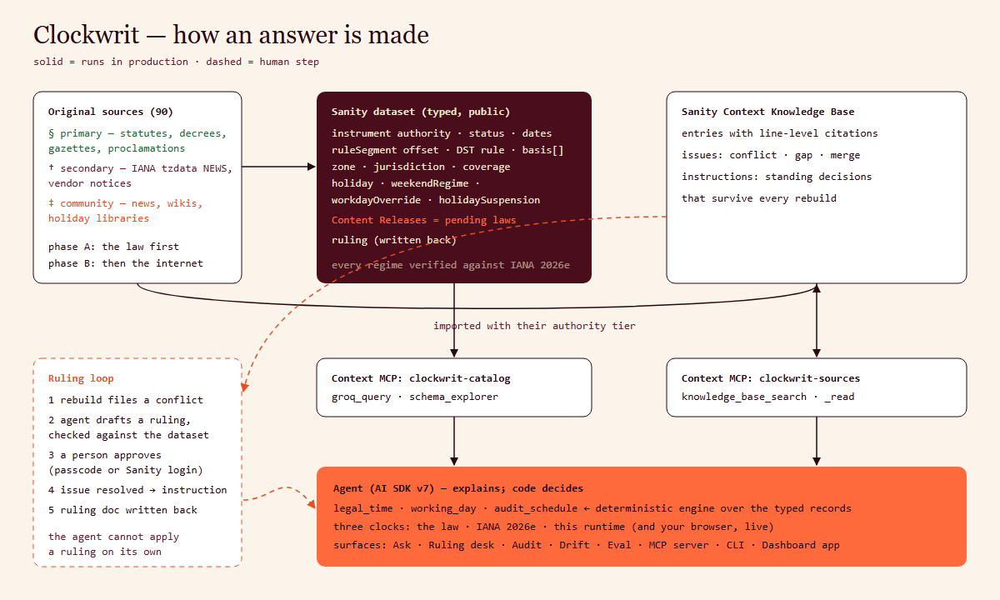

# Clockwrit

**What time is it — legally?** An agent that reads the law, IANA tzdata and your runtime’s clock, and tells you which one is right, with the decree, the date and the source quote. Built on [Sanity Context](https://www.sanity.io/context): a typed dataset for the facts, a Knowledge Base for what the sources say, and a ruling loop for when they disagree.

**Live:** https://clockwrit.vercel.app · **Ask:** [/ask](https://clockwrit.vercel.app/ask) · **Ruling desk:** [/desk](https://clockwrit.vercel.app/desk) · **Eval:** [/eval](https://clockwrit.vercel.app/eval) · **MCP:** `https://clockwrit.vercel.app/api/mcp` · Reviewing? Start with [JUDGES.md](JUDGES.md).



## Why this exists

In 2026 Canada stopped changing its clocks one province at a time: British Columbia, Alberta, the Northwest Territories, then Manitoba from 31 October. IANA shipped five tzdata releases (2026a–e) to keep up, and for some of them deliberately models the change on 1 November at 02:00 — a documented “temporary hack” — while the law takes effect on another date. Morocco moved back to GMT on 20 September. Meanwhile the runtime you deploy to ships whatever tz data it was built with:

| Runtime | tz data | Zones wrong in 2026–27 vs IANA 2026e |
|---|---|---|
| Node 24.13 (local) | 2025b | 11 of 597 — every Canadian change plus Morocco |
| Vercel’s Node (this deployment) | 2026c | 4 — Winnipeg, Rainy River, Inuvik and the Canada/Central link |

So on Monday 2 November 2026 a meeting scheduled “10:00 Winnipeg” lands an hour off on a stale server, and a keyword search will happily tell you Ukraine abolished daylight saving time (the bill was never signed). Getting these right means **computing over typed, time-scoped, authority-ranked facts** — not retrieving text.

## What it does

- **Ask** — an agent that answers with the local time, the offset, whether it’s a working day, and the instrument it rests on. Tool results render as cards: four clocks side by side (the law, IANA 2026e, this server, *your* browser, read live), and every basis with its authority tier and status.
- **Pending laws as Content Releases** — the US Sunshine Protection Act, Ukraine’s bill 4201, Florida’s conditional law, the EU proposal and others are modelled as releases. Pick one and the agent answers *as if it had passed*: same queries, read through the release perspective.
- **Ruling desk** — the Knowledge Base raises conflicts when sources disagree (e.g. Manitoba: the proclamation says 31 October, tzdata models 1 November). The agent drafts a ruling, checked against the typed records; it cannot apply it. A reviewer approves (passcode, or their Sanity identity from the Dashboard app), the issue is resolved through the Knowledge Base API, and the decision becomes a standing instruction for every later build.
- **Audit** — paste an `.ics` (or describe a recurring meeting) and get every occurrence checked: local times that don’t exist or happen twice, runtimes that place it at the wrong instant, and participants for whom it falls on a holiday, a rest day or outside hours.
- **Drift** — which zones this server’s tz data gets wrong, and which ones *your browser* gets wrong, live.
- **Integrator surface** — an MCP server (`legal_time`, `working_day`, `audit_schedule`), a CLI (`clockwrit now | day | audit | drift`), a JSON API, and a Sanity Dashboard app.

## Why it only works because the content is structured

Held-out evaluation, 30 questions written from verified sources before the agent existed (10 more were used during development and are excluded), graded by a model from a different family against the answer key ([eval/](eval), [results](eval/results)):

| Arm | Correct | Traps correct | Abstained |
|---|---|---|---|
| **Clockwrit** (typed dataset + Knowledge Base + legal-time tools) | **30 / 30** | **14 / 14** | 0 |
| Same model, no tools | 22 / 30 | 8 / 14 | 0 |
| Keyword search (BM25 over the same 90 sources) + same model | 16 / 30 | 6 / 14 | 8 |

The model alone is confidently wrong exactly where the world changed this year (Morocco, Manitoba, Pakistan’s Eid dates). Keyword search made it *worse*: the passages that match the words rarely carry the date, status or effective instant that decides the answer, so it either abstained or followed the headline. Read every question, answer and verdict at [/eval](https://clockwrit.vercel.app/eval).

The dataset was built from the same research the questions were written from, so this measures whether structure gets an agent to the right answer — not whether it can discover facts it was never given. See [docs/CLAIMS.md](docs/CLAIMS.md) for what is and isn’t claimed.

## How it uses Sanity

| Piece | What it does here |
|---|---|
| **Typed dataset** (`studio/schemaTypes`) | `instrument` (authority, legal status, dates, verbatim quotes in the original language), `ruleSegment` (UTC offset + DST rule in zic notation, valid-from/to, `basis[]` → instruments), `zone`, `jurisdiction` (with per-year calendar coverage), `holiday`, `weekendRegime`, `workdayOverride`, `holidaySuspension`, `ruling`. 845 documents, public dataset. |
| **Content Releases** | Seven pending or conditional laws, each a release containing the documents as they would read once it passes. Read through `perspective: [releaseId]` by the tools and by the Context endpoint. |
| **Context MCP — `clockwrit-catalog`** | GROQ mode over the dataset (`groq_query`, `schema_explorer`), with instructions explaining authority and status. |
| **Context Knowledge Base — `clockwrit-sources`** | 90 original sources imported in two phases (the law first, then news, vendor notices and libraries), each with its authority tier in a header. Line-level citations; conflicts raised by the build. |
| **Knowledge Base issues API** | Conflicts are listed with their sides and quoted spans, resolved by the reviewer’s decision, and become instructions that survive rebuilds. |
| **Insights** | Every Ask conversation is saved to the Context store via `@sanity/context`’s AI SDK integration. |
| **App SDK** (`desk/`) | A Dashboard app: live rulings (`useDocuments` / `useDocumentProjection`), approval signed with the reviewer’s own Sanity token, pending laws via `useActiveReleases`. |
| **Studio** | Hosted at clockwrit.sanity.studio, with structure grouped by clock, calendar, instruments by authority, and rulings by status. |

## Proof you can run

```sh
pnpm install
pnpm --filter @wallclock/core test            # 30 engine tests: zic rules, DST gaps/overlaps, calendars, audits
pnpm --filter @wallclock/knowledge check      # every clock regime in the dataset vs IANA 2026e, hourly around each transition, 2020–2028
pnpm --filter @wallclock/core drift 2026 2027 # which zones YOUR Node gets wrong
pnpm --filter @wallclock/eval eval            # re-run the held-out evaluation (needs LLM_API_KEY and a running agent)
```

Public dataset (no token): [all instruments with authority and status](https://c9x90tjo.api.sanity.io/v2026-09-01/data/query/production?query=*%5B_type%3D%3D%22instrument%22%5D%7Btitle%2Cauthority%2Cstatus%2Curl%7D).

## Run it locally

```sh
pnpm install
cp web/.env.example web/.env.local           # fill in Sanity project/org ids, tokens and an LLM endpoint
pnpm --filter @wallclock/knowledge seed      # load knowledge/dataset/*.json + the pending-law releases
pnpm --filter @wallclock/knowledge kb create # then: kb import A, kb build, kb import B, kb build
pnpm --filter web dev
```

The agent uses any OpenAI-compatible chat endpoint with tool calling (`LLM_BASE_URL`, `LLM_MODEL`); the deployment runs Claude Sonnet through Venice.

## Repository

| Path | |
|---|---|
| `packages/core` | The deterministic engine: legal offset from zic-style rules, local-time resolution (gaps, overlaps), working days, schedule audits, the IANA reference (tzdata 2026e, zic-compiled) and runtime readings. |
| `web` | Next.js 16 app: pages, the agent (`src/lib/agent.ts`), tools, the ruling loop, the MCP server and the API. |
| `studio` | Sanity Studio and the schema. |
| `desk` | Sanity App SDK Dashboard app. |
| `knowledge` | The reviewed dataset, the 90-source corpus, the seeder, the Knowledge Base scripts and the dataset checker. |
| `eval` | Questions with the answer key, the keyword baseline, the runner and the judge, and the results. |
| `packages/cli` | `clockwrit` command-line client. |

## Honest limits

- **Coverage is deliberate, not global.** 47 zones and 58 jurisdictions where something changed or is contested since 2019. Outside them the agent says so instead of guessing. Holiday lists are complete only for the years marked complete per jurisdiction; elsewhere a “working day” answer says it is unverified.
- **The legal date and the tzdata date differ on purpose.** For British Columbia, Alberta, the NWT and Manitoba the dataset records the legal effective instant; IANA models the change on 1 November 02:00. The UTC offset is identical either way; the DST flag and abbreviation are not. Lebanon in March 2023 is the one recorded case where the offset itself differs.
- **Some primary texts could not be retrieved** (Ukraine’s Cabinet Resolution 509, Mexico’s DOF, Moldova’s Monitorul Oficial, Morocco’s Arabic decrees, two scanned Russian decrees). Those facts rest on official announcements and IANA’s notes, and are marked as such.
- **Two pending bills have no effective date in their text** (US H.R. 139, Ukraine 4201). Their releases assume the earliest date the text allows; the release descriptions say so.
- **The Knowledge Base rewrites its entries on every full build** and tags authority unreliably on its own; Clockwrit takes authority from the typed records, not from the build.
- **Rate limiting is per instance and in memory.** A distributed client can exhaust a bucket’s shared ceiling; it fails closed on purpose, to cap model spend.
- **Approvals with the public passcode are recorded under the name the reviewer types.** Approvals from the Dashboard app are signed with the reviewer’s Sanity identity and require org admin plus write access to the ruling.

## License

MIT
